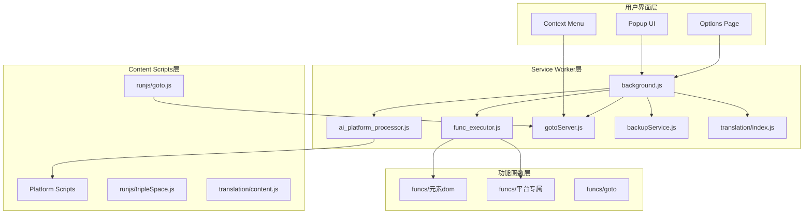

# Bro Chat (AI Assistant) - 多端AI调度工具

<div align="center">


**一站式管理多个AI平台的智能浏览器扩展**

[功能介绍](#-核心功能) • [技术架构](#-技术架构) • [快速开始](#-快速开始) • [开发指南](#-开发指南)

[English](./README.en.md)

</div>

## 📖 项目简介

Bro Chat 是一个功能强大的浏览器扩展，旨在解决用户需要在不同AI平台间频繁切换的问题。通过统一的界面，用户可以同时向多个AI平台（元宝、Gemini、ChatGPT、Claude、豆包、GLM、通义千问、Google Studio）发送消息，极大提升了工作效率。

### 解决的问题

- **多平台切换痛点**：无需在不同标签页间来回切换，一次输入多平台发送
- **重复输入成本**：统一的输入界面，支持消息模板和快捷操作
- **工具分散问题**：集成翻译、OCR、文件处理、导航等多种实用工具
- **工作流中断**：保持专注的工作状态，减少操作步骤

## ✨ 核心功能

### 🎯 多平台消息调度

支持的AI平台：
- **元宝** (腾讯元宝) - https://yuanbao.tencent.com
- **Gemini** (Google) - https://gemini.google.com
- **ChatGPT** (OpenAI) - https://chatgpt.com
- **Claude** (Anthropic) - https://claude.ai
- **豆包** (字节跳动) - https://www.doubao.com
- **GLM** (智谱) - https://chatglm.cn
- **通义千问** (阿里) - https://www.qianwen.com
- **Google Studio** (GAS) - https://aistudio.google.com

**特性**：
- 智能任务队列，支持串行和并发处理模式
- 自动标签页管理（查找/创建/激活）
- 动态脚本注入，无需手动配置

### 🛠️ 实用工具集成

| 功能 | 描述 | 快捷键 |
|------|------|--------|
| 拖拽文件处理 | 支持文件/文件夹拖拽，智能提取内容 | - |
| div copy | 复制页面元素内容 | Alt+C |
| 图片选择器 | 快速选择和处理图片 | Alt+D |
| 剪贴板保存 | 将剪贴板内容保存为文件 | Alt+F |
| 三击空格 | 快速调用AI助手 | 三击空格键 |

### 🎨 用户友好界面

- 响应式设计，适配不同屏幕尺寸
- 平台可见性配置，个性化界面
- 历史消息记录（最近5条），快速重发
- 实时状态反馈和进度显示
- 蓝色主题统一风格

### 📌 圆形导航菜单

- **悬浮激活**：鼠标悬浮即可展开菜单
- **拖动定位**：可拖动到屏幕任意位置，自动记忆
- **自定义配置**：右键添加链接到菜单
- **历史记录集成**：自动显示最近24小时的浏览历史
- **智能导航**：相同域名自动复用标签页

### 🌐 翻译与OCR

- **划词翻译**：选中文本即时显示翻译结果
- **OCR识别**：图片文字提取功能
- **Markdown渲染**：支持Markdown格式和数学公式（KaTeX）
- **多语言支持**：集成多种翻译服务

### 📦 备份服务

- **定时备份**：可设置自动备份间隔（默认24小时）
- **手动备份**：一键导出所有扩展数据
- **自动清理**：自动删除超过指定数量的旧备份
- **JSON格式**：便于迁移和恢复

## 🏗️ 技术架构

### 整体架构图



### 核心技术栈

- **前端框架**: 原生JavaScript (ES6+ Modules)
- **扩展标准**: Chrome Extensions Manifest V3
- **存储方案**: chrome.storage.local + localStorage
- **通信机制**: chrome.runtime.sendMessage / chrome.tabs.sendMessage
- **脚本注入**: chrome.scripting.executeScript
- **UI框架**: 原生CSS + 响应式设计
- **依赖库**: marked.min.js (Markdown), katex.min.js (数学公式)

### 架构特点

#### 1. 分层架构设计

| 层级 | 职责 | 主要模块 |
|------|------|----------|
| **UI层** | 用户交互界面 | popup/, options/ |
| **服务层** | 业务逻辑处理 | backgroudtask/ |
| **适配层** | 平台适配脚本 | contentScripts/ |
| **运行层** | 页面注入脚本 | runjs/ |
| **功能层** | 可执行函数库 | funcs/ |

#### 2. 消息驱动架构

```
Popup → sendMessage → Background
    ↓
    验证/处理
    ↓
    查找/创建Tab → 注入Content Script → 发送消息
    ↓
    返回结果 → Popup
```

#### 3. 模块化设计

- **单一职责**: 每个模块只负责特定功能
- **松耦合**: 模块间通过消息通信
- **高内聚**: 相关功能集中在同一目录
- **易扩展**: 新增平台或功能只需添加对应文件

## 📂 项目结构

```
ext/
├── manifest.json                 # Manifest V3 配置
├── background.js                 # Service Worker 入口
│
├── popup/                        # 弹窗界面
│   ├── popup.html               # 主界面
│   ├── popup/
│   │   ├── popup.js             # 入口
│   │   ├── popupUtils.js        # 核心逻辑
│   │   └── dragDropHandler.js   # 拖拽处理
│   ├── promots/                 # 消息模板
│   ├── func_execute/            # 功能执行UI
│   ├── translation/             # 翻译界面
│   └── multpromots/             # 多提示词界面
│
├── options/                      # 设置页面
│   ├── options.html             # 主设置页（带侧边栏）
│   ├── options.js               # 导航逻辑
│   ├── options.css              # 蓝色主题样式
│   ├── platform/                # 平台可见性设置
│   ├── storage/                 # 存储调试工具
│   ├── menu/                    # 菜单配置（可视化+JSON）
│   ├── backup/                  # 备份设置
│   └── api/                     # API设置
│
├── contentScripts/               # AI平台适配脚本
│   ├── chatgpt.js               # ChatGPT
│   ├── claude.js                # Claude
│   ├── gemini.js                # Gemini
│   ├── yuanbao.js               # 元宝
│   ├── doubao.js                # 豆包
│   ├── glm.js                   # GLM
│   ├── tongyi.js                # 通义千问
│   ├── googlestudio.js          # Google Studio
│   └── platform.template.js     # 平台模板
│
├── backgroudtask/                # 后台服务模块
│   ├── ai_platform_processor.js # AI平台任务队列
│   ├── func_executor.js         # 函数执行器
│   ├── gotoServer.js            # 导航/菜单服务
│   ├── word_http_server.js      # Word集成服务
│   ├── message_http_server.js   # 消息服务
│   ├── video_plane_server.js    # 视频控制服务
│   ├── backupService.js         # 备份服务
│   └── translation/             # 翻译/OCR模块
│       ├── index.js
│       ├── contextMenu.js
│       ├── messageHandler.js
│       ├── ocr.js
│       └── storage.js
│
├── runjs/                        # 页面注入脚本
│   ├── goto/
│   │   └── goto.js              # 圆形菜单
│   ├── tripleSpace/
│   │   ├── tripleSpace.js       # 三击激活
│   │   └── tripleSpace.css
│   ├── word/
│   │   └── word.js              # Word集成
│   ├── bilibiliCleaner/
│   │   └── bilibiliCleaner.js   # B站视频页清理
│   └── translation/             # 翻译覆盖层
│       ├── content.js
│       ├── content-ocr.js
│       ├── content.css
│       ├── content-ocr.css
│       └── lib/
│           ├── marked.min.js
│           └── katex.min.js
│
├── funcs/                        # 可执行函数库
│   ├── 元素dom/                 # DOM操作工具
│   │   ├── input.js
│   │   ├── div_copy_input_dom.js
│   │   ├── div_Img_wrapper.js
│   │   └── videoControllerPlane/
│   ├── 平台专属/                # 平台特定功能
│   │   ├── bili/                # B站工具
│   │   ├── leecode/             # LeetCode工具
│   │   ├── 腾讯文档/            # 腾讯文档工具
│   │   └── boss直聘/            # Boss直聘工具
│   ├── goto/                    # 导航工具
│   ├── word/                    # Word工具
│   └── x/                       # 实验性功能
│
└── icons/                        # 扩展图标
    ├── icon16.png
    ├── icon48.png
    └── icon128.png
```

## 🚀 快速开始

### 安装步骤

1. **克隆项目**
   ```bash
   git clone https://github.com/your-username/bro-chat.git
   cd br_controller/ext
   ```

2. **加载扩展**
   - 打开 Chrome/Edge 浏览器
   - 访问 `chrome://extensions/`
   - 开启"开发者模式"
   - 点击"加载已解压的扩展程序"
   - 选择项目目录

3. **配置权限**
   - 确保扩展有必要的权限
   - 检查各AI平台的访问权限

### 基本使用

#### 发送消息到AI平台

1. 点击扩展图标打开popup
2. 选择目标AI平台（可多选）
3. 输入消息内容
4. 点击发送

#### 拖拽文件处理

1. 直接拖拽文件/文件夹到输入框
2. 自动提取文件内容
3. 支持文件夹递归处理

#### 使用圆形菜单

1. **悬浮展开**：鼠标悬浮在圆形图标上
2. **拖动定位**：按住拖动到合适位置
3. **右键添加**：在任意链接/页面右键选择"添加到圆形菜单"

#### 使用快捷键

- `Alt+C`: 执行复制脚本
- `Alt+D`: 图片选择器
- `Alt+F`: 保存剪贴板到文件

## 📚 开发指南

### 添加新的AI平台

#### 1. 创建Content Script

```javascript
// contentScripts/newplatform.js
// 防止重复注入
if (window.newplatformInjected) return;
window.newplatformInjected = true;

// 定义选择器
const SELECTORS = {
  input: '//xpath_to_input',           // 输入框XPath
  sendButton: '//xpath_to_send_button' // 发送按钮XPath
};

// 监听消息
chrome.runtime.onMessage.addListener((message, sender, sendResponse) => {
  if (message.action === 'sendMessage') {
    sendMessage(message.message)
      .then(result => sendResponse({ status: 'ok', result }))
      .catch(error => sendResponse({ status: 'failed', error: error.message }));
    return true; // 保持消息通道
  }
});

// 发送消息函数
async function sendMessage(message) {
  try {
    // 1. 查找输入框
    const inputElement = document.evaluate(
      SELECTORS.input,
      document,
      null,
      XPathResult.FIRST_ORDERED_NODE_TYPE,
      null
    ).singleNodeValue;

    if (!inputElement) {
      throw new Error('未找到输入框');
    }

    // 2. 填充消息
    inputElement.focus();
    inputElement.value = message;
    inputElement.dispatchEvent(new Event('input', { bubbles: true }));

    // 3. 查找并点击发送按钮
    const sendButton = document.evaluate(
      SELECTORS.sendButton,
      document,
      null,
      XPathResult.FIRST_ORDERED_NODE_TYPE,
      null
    ).singleNodeValue;

    if (!sendButton) {
      throw new Error('未找到发送按钮');
    }

    sendButton.click();
    return { success: true };
  } catch (error) {
    throw error;
  }
}
```

#### 2. 更新平台URL配置

```javascript
// backgroudtask/ai_platform_processor.js
export const platformUrls = {
  // ... 现有平台
  newplatform: 'https://newplatform.com/chat'
};
```

#### 3. 更新UI

```html
<!-- popup/popup.html -->
<label class="platform-icon-option" data-platform-id="newplatform">
  <input type="checkbox" data-platform="newplatform">
  <div class="icon-wrapper">NP</div>
  <div class="platform-label">New Platform</div>
</label>
```

### 添加新的功能函数

#### 1. 创建功能脚本

```javascript
// funcs/custom/myFunction.js
export async function main() {
  try {
    console.log('功能执行开始');

    // 功能逻辑
    const result = await performAction();

    console.log('功能执行成功:', result);
    return result;
  } catch (error) {
    console.error('功能执行失败:', error);
    throw error;
  }
}

async function performAction() {
  // 具体实现
  return { success: true, data: '...' };
}
```

#### 2. 注册快捷键（可选）

```json
// manifest.json
"commands": {
  "execute_my_function": {
    "suggested_key": { "default": "Alt+M" },
    "description": "执行我的功能"
  }
}
```

#### 3. 在后台添加监听

```javascript
// backgroudtask/func_executor.js
export function setupFuncCommandListener() {
  chrome.commands.onCommand.addListener((command) => {
    if (command === "execute_my_function") {
      executeFunctionScript("custom/myFunction.js", (response) => {
        console.log("执行结果:", response);
      });
    }
  });
}
```

### 调试技巧

#### Service Worker 调试

1. 访问 `chrome://extensions/`
2. 找到扩展，点击"Service Worker"链接
3. 在打开的DevTools中查看日志

#### Popup 调试

1. 右键点击扩展图标
2. 选择"检查"
3. 在打开的DevTools中调试

#### Content Script 调试

1. 打开目标平台页面
2. 按F12打开DevTools
3. 在Console中查看日志

### 存储架构

#### chrome.storage.local 键

| 键名 | 类型 | 描述 |
|------|------|------|
| `messageHistory` | Array | 最近5条发送消息 |
| `platformStates` | Object | 平台复选框状态 |
| `platformVisibility` | Object | 平台可见性配置 |
| `customMenuConfig` | Object | 自定义菜单配置 |
| `backupSettings` | Object | 备份服务配置 |
| `promptQueue` | Array | 待处理消息队列 |
| `currentTasks` | Object | 当前任务状态 |

#### localStorage 键

| 键名 | 类型 | 描述 |
|------|------|------|
| `menuPosition` | Object | 圆形菜单位置 {left, top} |

## 🔧 核心技术实现

### 并发任务队列

```javascript
// 分批并发处理，避免浏览器过载
export async function processTaskQueueConcurrent(queue, options = {}) {
  const { maxConcurrent = 3, batchDelay = 300 } = options;

  const results = [];
  for (let i = 0; i < queue.length; i += maxConcurrent) {
    const batch = queue.slice(i, i + maxConcurrent);

    // 并发执行当前批次
    const batchResults = await Promise.allSettled(
      batch.map(task => processSingleTaskConcurrent(task))
    );

    results.push(...batchResults);

    // 批次间延迟
    if (i + maxConcurrent < queue.length) {
      await new Promise(resolve => setTimeout(resolve, batchDelay));
    }
  }

  return results;
}
```

### 智能标签页管理

```javascript
// 复用相同域名的标签页
async function findOrCreatePlatformTab(platform, shouldActive = false) {
  const targetUrl = platformUrls[platform];

  // 查找已存在的标签页
  const tabs = await chrome.tabs.query({});
  const existingTab = tabs.find(tab =>
    tab.url && tab.url.includes(targetUrl)
  );

  if (existingTab) {
    if (shouldActive) {
      await chrome.tabs.update(existingTab.id, { active: true });
    }
    return existingTab;
  }

  // 创建新标签页
  return await chrome.tabs.create({
    url: targetUrl,
    active: shouldActive
  });
}
```

## 🎯 性能优化

### 已实现的优化

1. **脚本懒加载**: 按需注入Content Scripts
2. **批量并发处理**: 避免同时打开过多标签页
3. **资源缓存**: 本地缓存用户配置
4. **防抖机制**: 优化输入保存性能
5. **内存管理**: 及时清理事件监听器和DOM元素

### 性能指标

| 指标 | 目标值 |
|------|--------|
| 启动时间 | < 100ms |
| 消息发送 | < 3s |
| 内存占用 | < 50MB |
| CPU使用 | < 5% |

## 🔒 安全性

### 安全措施

1. **权限最小化**: 只申请必要的浏览器权限
2. **内容隔离**: 沙盒化执行环境
3. **输入验证**: 严格的消息内容检查
4. **错误隔离**: 单个平台失败不影响其他

### 安全建议

- 定期更新依赖库
- 使用HTTPS通信
- 实施CSP策略
- 用户数据加密存储

## 📝 更新日志

### v1.5.0

- 新增 Google Studio 平台支持
- 优化并发任务处理逻辑
- 改进备份服务性能
- 修复已知问题

### v1.4.0

- 新增翻译和OCR功能
- 添加圆形菜单导航
- 改进UI响应式设计

## 🤝 贡献指南

### 开发流程

1. Fork项目
2. 创建功能分支 (`git checkout -b feature/AmazingFeature`)
3. 提交更改 (`git commit -m 'Add some AmazingFeature'`)
4. 推送到分支 (`git push origin feature/AmazingFeature`)
5. 创建Pull Request

### 代码规范

- 使用ES6+语法和模块化
- 遵循驼峰命名法
- 添加必要的注释
- 处理错误情况
- 保持代码简洁

## 📄 许可证

本项目采用MIT许可证 - 查看 [LICENSE](LICENSE) 文件了解详情

## 🙏 致谢

- Chrome Extensions API文档
- 各大AI平台提供的开放服务
- 开源社区的贡献者们

## 📞 联系方式

- 项目地址: [GitHub](https://github.com/your-username/bro-chat)
- 问题反馈: [Issues](https://github.com/your-username/bro-chat/issues)
- 功能建议: [Discussions](https://github.com/your-username/bro-chat/discussions)

---

<div align="center">

**如果这个项目对您有帮助，请给一个 ⭐️ 支持！**

Made with ❤️ by zhlx

</div>
