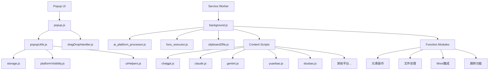

# Bro Chat - 多端AI调度工具

<div align="center">


**一站式管理多个AI平台的智能浏览器扩展**

[功能介绍](#核心功能) • [技术架构](#技术架构) • [快速开始](#快速开始) • [开发指南](#开发指南)

</div>

## 📖 项目简介

Bro Chat是一个强大的浏览器扩展，旨在解决用户需要在不同AI平台间频繁切换的问题。通过统一的界面，用户可以同时向多个AI平台（如元宝、Gemini、ChatGPT、Claude等）发送消息，极大提升了工作效率。

### 解决的问题

- **多平台切换痛点**：无需在不同标签页间来回切换
- **重复输入成本**：一次输入，多平台发送
- **工具分散问题**：集成常用功能如文件处理、截图等
- **工作流中断**：保持专注的工作状态

## ✨ 核心功能

### 🎯 多平台消息调度
- 支持元宝、Gemini、ChatGPT、Claude、豆包、通义等主流AI平台
- 智能任务队列，顺序处理避免冲突
- 自动标签页管理和激活

### 🛠️ 实用工具集成
- **拖拽文件处理**：支持文件/文件夹拖拽，智能提取内容
- **快捷键操作**：Alt+C/D/F 快速执行常用功能
- **三击空格**：快速调用AI助手
- **消息模板**：预设提示词模板，提高效率

### 🎨 用户友好界面
- 响应式设计，适配不同屏幕尺寸
- 平台可见性配置，个性化界面
- 历史消息记录，快速重发
- 实时状态反馈

### ⚙️ 高级功能
- **平台配置管理**：可视化配置各平台显示状态
- **消息优化器**：智能优化提示词
- **脚本库**：可扩展的功能脚本系统
- **数据持久化**：本地存储用户配置和历史

## 🏗️ 技术架构

### 整体架构图



### 核心技术栈

- **前端框架**: 原生JavaScript (ES6+)
- **扩展标准**: Chrome Extensions Manifest V3
- **模块化**: ES6 Modules
- **存储方案**: chrome.storage.local
- **通信机制**: chrome.runtime.sendMessage
- **脚本注入**: chrome.scripting.executeScript
- **UI框架**: 原生CSS + 响应式设计

### 架构特点

#### 1. 分层架构设计
- **表现层**: Popup UI提供用户交互界面
- **业务层**: Service Worker处理业务逻辑
- **适配层**: Content Scripts适配不同AI平台
- **功能层**: 可插拔的功能模块

#### 2. 事件驱动架构
- 基于Chrome Extension消息系统
- 异步任务队列处理
- 状态管理和同步机制

#### 3. 模块化设计
- 功能模块职责单一
- 松耦合高内聚
- 易于扩展和维护

## 🚀 快速开始

### 安装步骤

1. **克隆项目**
   ```bash
   git clone https://github.com/your-username/bro-chat.git
   cd bro-chat
   ```

2. **加载扩展**
   - 打开Chrome浏览器
   - 访问 `chrome://extensions/`
   - 开启"开发者模式"
   - 点击"加载已解压的扩展程序"
   - 选择项目目录

3. **配置权限**
   - 确保扩展有必要的权限
   - 检查各AI平台的访问权限

### 基本使用

1. **发送消息**
   - 点击扩展图标打开popup
   - 选择目标AI平台
   - 输入消息内容
   - 点击发送

2. **拖拽文件**
   - 直接拖拽文件到输入框
   - 自动提取文件内容
   - 支持文件夹递归处理

3. **使用快捷键**
   - Alt+C: 执行复制脚本
   - Alt+D: 图片选择器
   - Alt+F: 保存剪贴板到文件

## 📚 开发指南

### 项目结构

```
bro-chat/
├── manifest.json              # 扩展清单文件
├── background.js              # Service Worker入口
├── popup/                     # 弹窗界面
│   ├── popup.html            # 主界面HTML
│   ├── popup.js              # 主入口JS
│   ├── popupUtils.js         # 核心业务逻辑
│   ├── dragDropHandler.js    # 拖拽处理
│   ├── modules/              # 功能模块
│   │   ├── storage.js        # 存储管理
│   │   ├── platformVisibility.js  # 平台可见性
│   │   └── uiHelpers.js      # UI辅助函数
│   ├── promots/              # 提示词管理
│   ├── options/              # 设置页面
│   └── func_execute/         # 功能执行器
├── contentScripts/           # 平台适配脚本
│   ├── chatgpt.js            # ChatGPT适配
│   ├── claude.js             # Claude适配
│   ├── gemini.js             # Gemini适配
│   └── ...                   # 其他平台
├── backgroudtask/            # 后台任务处理器
│   ├── ai_platform_processor.js  # AI平台处理器
│   ├── func_executor.js      # 函数执行器
│   └── ...                   # 其他处理器
├── funcs/                    # 功能函数库
│   ├── 元素dom/              # DOM操作
│   ├── 平台专属/             # 平台特定功能
│   └── ...                   # 其他功能
└── tripleSpace/              # 三击空格功能
    ├── tripleSpace.js        # 核心逻辑
    └── tripleSpace.css       # 样式文件
```

### 添加新AI平台

1. **创建Content Script**
   ```javascript
   // contentScripts/newplatform.js
   export const selectors = {
     input: [
       { type: 'id', value: 'message-input' },
       { type: 'css', value: '.chat-input' }
     ],
     button: [
       { type: 'css', value: '.send-button' }
     ]
   };

   export async function sendMessage(message) {
     // 平台特定的发送逻辑
     try {
       const inputElement = await findElement(selectors.input);
       const sendButton = await findElement(selectors.button);

       // 填充消息并点击发送
       await setInputValue(inputElement, message);
       await clickElement(sendButton);

       return { success: true };
     } catch (error) {
       return { success: false, error: error.message };
     }
   }
   ```

2. **更新配置**
   ```javascript
   // backgroudtask/ai_platform_processor.js
   const platformUrls = {
     // 添加新平台URL
     newplatform: 'https://newplatform.com/chat'
   };
   ```

3. **更新UI**
   ```html
   <!-- popup/popup.html -->
   <label class="platform-icon-option" data-platform-id="newplatform">
     <input type="checkbox" data-platform="newplatform">
     <div class="icon-wrapper">NP</div>
     <div class="platform-label">New Platform</div>
   </label>
   ```

### 添加新功能

1. **创建功能脚本**
   ```javascript
   // funcs/custom/myFunction.js
   export async function main() {
     try {
       // 功能逻辑
       const result = await performAction();
       console.log('功能执行成功:', result);
       return result;
     } catch (error) {
       console.error('功能执行失败:', error);
       throw error;
     }
   }

   async function performAction() {
     // 具体实现
   }
   ```

2. **注册快捷键（可选）**
   ```json
   // manifest.json
   "commands": {
     "execute_my_function": {
       "suggested_key": {
         "default": "Alt+M"
       },
       "description": "执行我的功能"
     }
   }
   ```

### 调试技巧

1. **Service Worker调试**
   ```javascript
   // background.js
   console.log('Service Worker启动');

   // 监听所有消息
   chrome.runtime.onMessage.addListener((message, sender, sendResponse) => {
     console.log('收到消息:', message);
     console.log('发送者:', sender);
   });
   ```

2. **Content Script调试**
   ```javascript
   // 在目标平台控制台中
   console.log('Content Script已加载');

   // 检查元素
   const element = document.querySelector('#target-element');
   console.log('找到元素:', element);
   ```

## 🔧 核心技术实现

### 智能任务队列系统

```javascript
// backgroudtask/ai_platform_processor.js
class TaskQueue {
  constructor() {
    this.processing = false;
    this.queue = [];
  }

  async process() {
    if (this.processing) return;
    this.processing = true;

    while (this.queue.length > 0) {
      const task = this.queue.shift();
      try {
        await this.executeTask(task);
      } catch (error) {
        console.error('任务执行失败:', error);
      }
    }

    this.processing = false;
  }

  async executeTask(task) {
    // 1. 查找或创建标签页
    const tab = await this.findOrCreateTab(task.platform);

    // 2. 注入平台脚本
    await this.injectPlatformScript(tab.id, task.platform);

    // 3. 发送消息
    await this.sendMessageToTab(tab.id, task.message);
  }
}
```

### 多策略元素定位

```javascript
// 通用元素查找策略
async function findElement(selectors) {
  for (const selector of selectors) {
    try {
      let element;

      switch (selector.type) {
        case 'id':
          element = await waitForElement(`#${selector.value}`);
          break;
        case 'css':
          element = await waitForElement(selector.value);
          break;
        case 'xpath':
          element = await waitForXPath(selector.value);
          break;
      }

      if (element) return element;
    } catch (error) {
      console.warn(`选择器失败: ${selector.value}`);
    }
  }

  throw new Error('未找到目标元素');
}
```

### 文件拖拽处理

```javascript
// dragDropHandler.js
async function handleFiles(files) {
  const results = [];

  for (const file of files) {
    try {
      if (file.isDirectory) {
        const dirContent = await processDirectory(file);
        results.push(...dirContent);
      } else {
        const content = await processFile(file);
        results.push(content);
      }
    } catch (error) {
      console.error(`处理文件失败: ${file.name}`, error);
    }
  }

  return results;
}

async function processDirectory(directory) {
  const entries = await readAllEntries(directory);
  const results = [];

  for (const entry of entries) {
    if (entry.isFile) {
      const file = await getFileFromEntry(entry);
      const content = await processFile(file);
      results.push(content);
    }
  }

  return results;
}
```

## 🎯 性能优化

### 已实现的优化

1. **脚本懒加载**: 按需注入Content Scripts
2. **队列串行化**: 避免并发操作冲突
3. **资源缓存**: 本地缓存用户配置
4. **防抖机制**: 优化输入保存性能
5. **内存管理**: 及时清理事件监听器

### 性能指标

- **启动时间**: < 100ms
- **消息发送**: < 3s
- **内存占用**: < 50MB
- **CPU使用**: < 5%

## 🔒 安全性

### 安全措施

1. **权限最小化**: 只申请必要的浏览器权限
2. **内容隔离**: 沙盒化执行环境
3. **输入验证**: 严格的消息内容检查
4. **错误隔离**: 单个平台失败不影响其他

### 安全建议

- 定期更新依赖库
- 使用HTTPS通信
- 实施CSP策略
- 用户数据加密存储

## 🤝 贡献指南

### 开发流程

1. Fork项目
2. 创建功能分支 (`git checkout -b feature/AmazingFeature`)
3. 提交更改 (`git commit -m 'Add some AmazingFeature'`)
4. 推送到分支 (`git push origin feature/AmazingFeature`)
5. 创建Pull Request

### 代码规范

- 使用ES6+语法
- 遵循驼峰命名
- 添加必要的注释
- 处理错误情况

## 📄 许可证

本项目采用MIT许可证 - 查看 [LICENSE](LICENSE) 文件了解详情

## 🙏 致谢

- Chrome Extensions API文档
- 各大AI平台提供的开放接口
- 开源社区的贡献者们

## 📞 联系方式

- 项目地址: [https://github.com/your-username/bro-chat](https://github.com/your-username/bro-chat)
- 问题反馈: [Issues](https://github.com/your-username/bro-chat/issues)
- 功能建议: [Discussions](https://github.com/your-username/bro-chat/discussions)

---

<div align="center">

**如果这个项目对您有帮助，请给一个⭐️支持！**

Made with ❤️ by zhlx

</div>